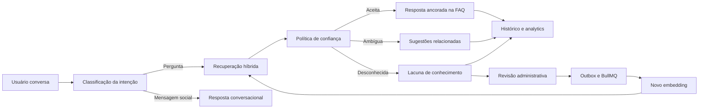

# Walkthrough da arquitetura

Este documento é um guia interno para estudar e apresentar o FAQ Intelligence. Ele acompanha a
tela protegida e propositalmente não listada no menu administrativo:

```text
http://localhost:5173/admin/walkthrough
```

O objetivo não é apenas descrever componentes, mas explicar por que cada decisão existe e como o
sistema transforma uma conversa em melhoria contínua da base de conhecimento.

## Visão geral



## 1. A pergunta entra como conversa

O React mantém o histórico recente da conversa e envia a nova mensagem para
`POST /api/v1/chat/questions`. A API recebe texto, sessão e contexto, mas o controller não contém
regra de negócio.

**Motivação:** preservar uma fronteira HTTP pequena. Validação, autenticação e serialização ficam
no adapter; a decisão sobre o que responder pertence ao caso de uso.

Código para estudar:

- [`apps/web/src/features/chat`](../apps/web/src/features/chat)
- [`apps/api/src/modules/chat/adapters/inbound/http/chat-routes.ts`](../apps/api/src/modules/chat/adapters/inbound/http/chat-routes.ts)
- [`apps/api/src/modules/chat/application/ask-question.ts`](../apps/api/src/modules/chat/application/ask-question.ts)

## 2. A intenção vem antes da busca

O agente distingue perguntas, continuações e mensagens sociais. Um agradecimento como “perfeito,
funcionou” recebe uma resposta curta e não inicia uma busca de FAQ.

**Motivação:** uma busca tecnicamente correta ainda produz uma conversa ruim se for executada na
hora errada. Classificar a intenção reduz consultas, custo de IA e respostas fora de contexto.

## 3. A recuperação combina sinais

A recuperação usa múltiplos sinais complementares:

1. cache Redis versionado;
2. pergunta exata e aliases;
3. busca textual do PostgreSQL;
4. similaridade por trigramas;
5. similaridade semântica com `pgvector`.

**Motivação:** busca exata é precisa, mas não entende paráfrases. Vetores entendem significado,
mas podem aproximar assuntos distintos. Texto completo e trigramas cobrem termos relevantes e
erros de digitação. A combinação melhora recall sem abandonar precisão.

Código para estudar:

- [`apps/api/src/modules/chat/adapters/outbound/postgres-faq-search.ts`](../apps/api/src/modules/chat/adapters/outbound/postgres-faq-search.ts)
- [`apps/api/src/modules/chat/adapters/outbound/redis-answer-cache.ts`](../apps/api/src/modules/chat/adapters/outbound/redis-answer-cache.ts)
- [`apps/api/src/modules/chat/domain/retrieval-policy.ts`](../apps/api/src/modules/chat/domain/retrieval-policy.ts)

## 4. A confiança limita o que a IA pode dizer

A política classifica o resultado em aceito, ambíguo ou desconhecido. Quando existe uma única
resposta suficientemente confiável, ela é entregue diretamente. Várias candidatas plausíveis
viram sugestões. Sem evidência aprovada, o assistente admite que não sabe e pede contexto ou
informa que uma pessoa entrará em contato.

A OpenAI melhora a apresentação e usa o contexto da conversa, mas deve permanecer ancorada no
conteúdo aprovado.

**Motivação:** naturalidade não pode significar invenção. A empresa controla os fatos; a IA
controla somente a forma de comunicá-los.

## 5. A interação vira evidência

Toda tentativa gera um registro imutável usado pelo dashboard. Perguntas desconhecidas também são
normalizadas e agrupadas em lacunas de conhecimento.

**Motivação:** métricas precisam ser reproduzíveis, e uma pergunta sem resposta é um sinal de
produto. Preservar o evento original permite explicar números e priorizar conteúdo pelo volume
real de usuários.

Código para estudar:

- [`apps/api/src/modules/analytics`](../apps/api/src/modules/analytics)
- [`apps/api/src/modules/knowledge-gaps`](../apps/api/src/modules/knowledge-gaps)

## 6. O administrador fecha o ciclo

Na tela de perguntas sem resposta, o administrador pode analisar ocorrências e criar ou atualizar
uma FAQ. A transação salva a resolução e um evento de outbox. O relay publica esse evento no
BullMQ; o worker gera o embedding e ativa a resposta para pesquisas futuras.

O Bull Board está disponível em `http://localhost:5173/admin/queues/` durante o desenvolvimento.
Em produção, o endpoint continua protegido.

**Motivação:** gerar embeddings dentro da requisição tornaria a interface dependente da latência e
da disponibilidade de um serviço externo. O outbox garante que banco e intenção de processamento
sejam gravados atomicamente; a fila permite repetição, backoff e inspeção operacional.

Código para estudar:

- [`apps/api/src/infrastructure/queue`](../apps/api/src/infrastructure/queue)
- [`apps/api/src/infrastructure/database/migrations`](../apps/api/src/infrastructure/database/migrations)
- [`apps/web/src/features/knowledge-gap-admin`](../apps/web/src/features/knowledge-gap-admin)

## Como explicar a arquitetura

Um roteiro curto para apresentação:

1. “O sistema não é apenas uma busca: primeiro entende se a mensagem exige uma FAQ.”
2. “Quando exige, combina busca lexical e semântica para aumentar as chances sem perder controle.”
3. “A IA apresenta conteúdo aprovado; a política de confiança impede respostas inventadas.”
4. “Toda interação alimenta métricas e transforma desconhecimento em uma fila administrativa.”
5. “Outbox e BullMQ fecham o ciclo com processamento assíncrono e recuperável.”
6. “A arquitetura hexagonal deixa PostgreSQL, Redis, OpenAI, Fastify e BullMQ como adapters
   substituíveis em torno de regras testáveis.”

## Princípios usados

- **Arquitetura hexagonal:** domínio e casos de uso dependem de portas, não de infraestrutura.
- **Clean Architecture:** dependências apontam para as regras centrais.
- **SOLID:** interfaces pequenas separam busca, cache, persistência, IA e filas.
- **KISS:** cada etapa possui uma responsabilidade identificável e testável.
- **Red/Green:** comportamento esperado é registrado em teste antes da implementação.
