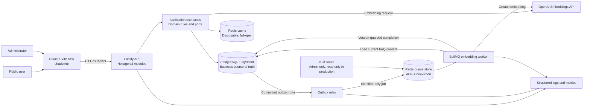
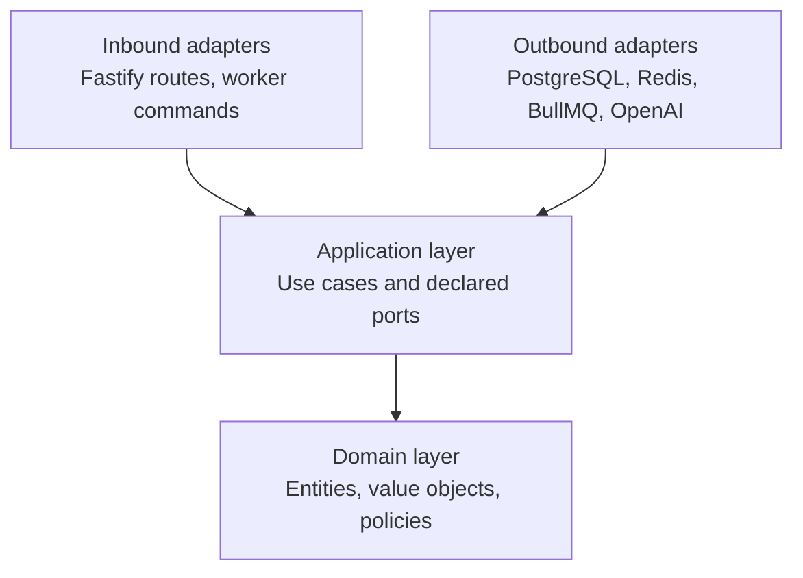

# FAQ Intelligence Platform

## System Design

| Metadata | Value |
|---|---|
| Status | Proposed |
| Last updated | July 30, 2026 |
| Scope | Single-organization FAQ chatbot, administration, and analytics MVP |
| Primary specification | [Feature specification](../specs/001-faq-chatbot-analytics/spec.md) |
| Implementation plan | [Implementation plan](../specs/001-faq-chatbot-analytics/plan.md) |
| API contract | [OpenAPI 3.1 contract](../specs/001-faq-chatbot-analytics/contracts/openapi.yaml) |
| Queue contract | [FAQ embedding jobs](../specs/001-faq-chatbot-analytics/contracts/queue-jobs.md) |
| Data model | [Domain and persistence model](../specs/001-faq-chatbot-analytics/data-model.md) |
| Delivery tasks | [Dependency-ordered task list](../specs/001-faq-chatbot-analytics/tasks.md) |

## 1. Abstract

The FAQ Intelligence Platform automates answers to recurring questions and gives administrators
visibility into demand, unanswered topics, and knowledge-base quality. A public React application
sends natural-language questions to a Node.js API. The API returns only active,
administrator-approved FAQ content, using PostgreSQL exact and full-text search plus pgvector
semantic similarity. OpenAI generates embeddings; it does not generate user-facing answers.

PostgreSQL is the business source of truth. A disposable Redis instance accelerates repeated
queries, while a separate persistent Redis instance stores BullMQ operational state. FAQ
embedding work is committed through a PostgreSQL outbox, relayed to BullMQ, and completed by an
idempotent worker. Low-confidence questions produce a safe fallback and become durable,
administratively resolvable knowledge gaps.

The application is a pnpm TypeScript monorepo with a React/Vite frontend, a Fastify API, Docker
development and production environments, and independently runnable API, relay, and worker
processes.

## 2. Goals and Non-goals

### Goals

- Return the correct approved FAQ as the top result for at least 90% of answerable questions in a
  representative evaluation set.
- Return an explicit fallback for 100% of questions without a reliable match; never fabricate an
  answer.
- Display at least 95% of answered searches within two seconds under normal conditions.
- Record every completed interaction as an immutable historical snapshot.
- Make unanswered interactions available as grouped administrative knowledge gaps within one
  minute.
- Let administrators maintain FAQs, resolve or dismiss knowledge gaps, and inspect a consistent
  analytics dashboard.
- Support at least 100 concurrent chat sessions and dashboard periods up to 12 months.
- Preserve explainable boundaries through Hexagonal Architecture, Clean Architecture, KISS, and
  SOLID.

### Non-goals

- Generative or rewritten answers from an AI model.
- Human-agent conversations inside the platform.
- Report export.
- Multiple organizations or tenant isolation.
- Multilingual operation.
- Individual accounts for public chatbot users.
- Automatic semantic merging of separate unanswered-question groups.
- Retrospective changes to historical interaction outcomes after a knowledge gap is resolved.

## 3. Background and Problem Statement

Organizations repeatedly spend human support capacity answering questions whose approved answers
already exist. Exact keyword lookup is insufficient because users express the same intent with
paraphrases, accents, punctuation differences, acronyms, and small typing errors. A semantic
retrieval layer improves discoverability, but an unconstrained generative model would introduce
hallucination, privacy, and audit risks.

The platform must therefore balance retrieval quality with strict grounding:

- only approved knowledge may become an answer;
- uncertain matches must remain unanswered;
- every user-visible outcome must be recorded as it occurred;
- cache and queue infrastructure must not become business sources of truth;
- an administrator must be able to turn recurring unanswered questions into approved searchable
  knowledge;
- analytics must remain reproducible even after the current backlog changes.

## 4. Proposed Architecture

### 4.1 System context and critical data flow



### 4.2 Dependency direction



Domain and application modules do not import Fastify, PostgreSQL clients, Redis clients, BullMQ,
or the OpenAI SDK. Infrastructure adapters depend inward and are composed only in the API
bootstrap layer.

### 4.3 Core components

| Component | Responsibility | Primary state or dependency | Failure behavior |
|---|---|---|---|
| React web application | Public chat, administrator login, analytics, FAQ maintenance, and knowledge-gap workflow | Versioned `/api/v1` HTTP contract | Preserves user input, distinguishes loading/empty/error states, and offers safe retry |
| Fastify API | Validates requests, authorizes administrators, executes use cases, and returns stable errors | PostgreSQL, cache, and declared service ports | Fails closed for protected operations; never claims an interaction was recorded when its write failed |
| PostgreSQL with pgvector | Stores knowledge, vectors, interactions, gaps, sessions, audit events, and outbox messages | Durable transactional storage | Required writes fail the request; committed outbox work remains recoverable |
| Redis answer cache | Caches versioned positive and short-lived negative retrieval results | Disposable cache instance | Fails open and falls back to PostgreSQL/OpenAI retrieval |
| Outbox relay | Publishes committed embedding intent to BullMQ | PostgreSQL outbox and queue Redis | Leaves messages pending and reconciles them after queue recovery |
| BullMQ worker | Loads current FAQ content, creates embeddings, and conditionally activates FAQ versions | Queue Redis, PostgreSQL, and OpenAI | Retries recoverable failures; stale work is a no-op; exhausted resolution work returns the gap to open |
| Bull Board | Exposes operational queue visibility | BullMQ queue state | Admin-only and read-only in production; never determines business status |
| OpenAI adapters | Interpret bounded follow-ups, produce grounded conversational answers, and create 1,536-dimensional embeddings | Responses API with `gpt-5.6-luna`; embeddings with `text-embedding-3-small` | Disable response storage; generation failure returns approved text verbatim; semantic-only questions fall back safely |

## 5. Request and Job Lifecycles

### 5.1 Public question

1. The web application submits a question of 1–500 characters, an optional category, and at most
   six recent user/assistant messages.
2. The API validates the bounded history. When the question depends on prior turns, the
   conversational adapter rewrites it as a standalone search query without answering it.
3. The API normalizes the standalone query while retaining the original question for history.
4. The chat use case loads the current knowledge-base version and checks a hashed, versioned Redis
   key.
5. On a cache miss, exact matching is attempted. When necessary, OpenAI creates a query embedding
   and PostgreSQL returns the top five active candidates by cosine similarity.
6. The retrieval policy applies configurable defaults:
   - `>= 0.78`: return the best approved FAQ;
   - `0.70–0.78`: return an ambiguous result without asserting an answer;
   - `< 0.70`: return the unanswered fallback.
7. If retrieval accepts an FAQ, the conversational adapter writes a natural Portuguese response
   using only that FAQ. Provider failure returns the approved answer verbatim.
8. If OpenAI embeddings are unavailable, exact and PostgreSQL full-text search provide
   deterministic fallback.
9. PostgreSQL stores the immutable interaction result, including both displayed-answer and
   approved-source snapshots when an answer was shown.
10. Unanswered and ambiguous outcomes are atomically linked to a deterministically grouped
   knowledge gap.
11. The API returns the result and emits correlation-aware latency, outcome, retrieval, and cache
   telemetry.

### 5.2 FAQ creation or update

1. An authenticated administrator submits validated question, answer, category, and optional
   aliases.
2. A PostgreSQL transaction creates or updates an `embedding_pending` FAQ, increments its content
   version, and inserts one unique outbox message.
3. The relay claims committed outbox rows with row locking that skips locked rows.
4. BullMQ receives `prepare-faq-embedding` with deterministic job ID
   `faq-embedding-{faqId}-v{contentVersion}`.
5. The worker loads current content from PostgreSQL and requests the embedding outside database
   locks.
6. A completion transaction stores the vector only when the FAQ content version still matches,
   activates the FAQ, and increments the knowledge-base version.
7. Old cache entries expire naturally because new requests use the new knowledge-base version.

### 5.3 Knowledge-gap resolution

1. An administrator opens a grouped gap and reviews occurrences and append-only audit history.
2. The resolution request supplies an idempotency key, expected gap version, canonical question,
   approved answer, category, and optional aliases.
3. A short transaction locks the gap, detects conflicts, creates or updates the pending FAQ,
   records the resolution and event, inserts the outbox message, and moves the gap to `resolving`.
4. The API returns `202 Accepted` without waiting for OpenAI.
5. The worker resolves the gap only after the current FAQ embedding is stored and the FAQ is
   active.
6. Exhausted embedding failure marks the resolution failed, leaves the FAQ inactive, and returns
   the gap to `open`.
7. Dismiss and reopen actions append audit events and never delete historical occurrences.

## 6. API and Data Contracts

### 6.1 HTTP surface

The authoritative schemas and response codes are defined in
[`contracts/openapi.yaml`](../specs/001-faq-chatbot-analytics/contracts/openapi.yaml).

| Area | Main operations | Access |
|---|---|---|
| Health | `GET /health` | Public |
| Chat | `POST /chat/questions` | Public |
| Authentication | `POST /auth/login`, `GET /auth/session`, `POST /auth/logout` | Login is public; session/logout require a valid session |
| Categories | `GET /categories`, `POST /categories` | Administrator |
| FAQs | List, create, read, update, activate/deactivate, and retry embedding | Administrator |
| Knowledge gaps | List, inspect, resolve, dismiss, and reopen | Administrator |
| Analytics | `GET /analytics/summary?from=...&to=...` | Administrator |
| Queue operations | `/admin/queues` | Administrator plus trusted production network path |

State-changing administrator requests require both the server-side session cookie and a valid CSRF
token. Knowledge-gap mutations additionally require an `Idempotency-Key` header and an expected
version.

Errors use a stable envelope:

```json
{
  "code": "stable_error_code",
  "message": "Safe and actionable message",
  "requestId": "correlation identifier"
}
```

Optional `details` may describe validation issues but must not expose secrets or sensitive data.

### 6.2 Core durable records

| Record | Purpose | Important invariant |
|---|---|---|
| Category | Organizes FAQs and analytics | Active state controls administration choices, not historical records |
| FAQ Entry | Stores one approved canonical question and answer | Only `active` entries with a current embedding participate in semantic search |
| FAQ Alias | Stores administrator-approved alternative phrasing | Duplicate normalized aliases for the same FAQ are rejected |
| Interaction | Captures one immutable user-visible outcome | Historical answer and question snapshots never follow later FAQ edits |
| Knowledge Gap | Tracks current work for grouped unanswered occurrences | Occurrence totals are derived from linked immutable interactions |
| Gap Resolution | Represents one idempotent attempt to publish knowledge | Same key with a different request hash is rejected |
| Knowledge Gap Event | Provides append-only administrative audit | Inserted in the same transaction as the state transition |
| Queue Outbox Message | Durably records intent to enqueue embedding work | Unique by message type, aggregate ID, and aggregate version |
| Knowledge Base State | Supplies monotonically increasing cache version | Incremented only after searchable knowledge changes commit |

The complete field-level contract is available in
[`data-model.md`](../specs/001-faq-chatbot-analytics/data-model.md).

### 6.3 Queue contract

```json
{
  "faqId": "uuid",
  "contentVersion": 1,
  "resolutionId": "optional uuid"
}
```

Question text, answer text, user data, credentials, API keys, and raw provider responses are
prohibited from job payloads, progress, return values, and job logs.

## 7. Consistency, Idempotency, and Replay

| Scenario | Expected behavior | Consistency mechanism |
|---|---|---|
| Repeated public question | Each request creates its own Interaction; cache may reuse retrieval output | PostgreSQL records every occurrence, including cache hits |
| Repeated unanswered meaning | One deterministic KnowledgeGap links multiple immutable occurrences | Unique normalized-question hash and transactional upsert |
| Retried administrator mutation | Same key and payload return the original result; changed payload is rejected | Admin-scoped idempotency key plus request hash |
| Duplicate or replayed job | At most one effective state transition; duplicate execution becomes a no-op | Deterministic job ID plus PostgreSQL content-version and resolution guards |
| Queue Redis unavailable after commit | Business transaction remains committed and work is published later | PostgreSQL transactional outbox and reconciliation |
| Worker receives stale FAQ version | Stale vector never activates newer FAQ content | Conditional completion by FAQ ID and content version |
| Embedding failure exhausts retries | FAQ remains inactive; pending gap returns to open | Explicit failure transaction and audit event |
| FAQ edited after an earlier answer | New questions use the new version; old interactions remain unchanged | Immutable interaction snapshots and knowledge-base cache version |

BullMQ delivery is at least once. Queue deduplication improves efficiency, but correctness depends
on PostgreSQL state, version checks, unique constraints, and idempotent transitions.

## 8. Security and Privacy Considerations

- Public users may access only the chat and health surfaces.
- Dashboard, FAQ administration, knowledge gaps, interaction details, and Bull Board require an
  active administrator session.
- Administrator authentication uses server-side sessions referenced by `HttpOnly`, `Secure`, and
  `SameSite` cookies.
- State-changing administrator requests require CSRF protection.
- Login and public chat are rate limited; login errors remain generic.
- The production Bull Board route is read-only and additionally restricted through a trusted
  network, VPN, or protected reverse proxy.
- OpenAI receives only the current question, at most six recent anonymous messages, and the one
  approved FAQ selected for grounding. It does not receive IP addresses, authentication data, or
  user identity, and Responses API storage is disabled.
- API keys and bootstrap credentials exist only in server-side secret configuration.
- Raw question text, answers, secrets, and personal data are excluded from ordinary logs, queue
  payloads, cache keys, and analytics dimensions.
- The organization defines interaction retention. The implementation must apply data minimization
  and support approved retention or redaction operations without falsifying historical outcomes.
- Operational retry or cleanup actions must not bypass audited business endpoints.

## 9. Operational Readiness

### 9.1 Service objectives and launch gates

| Signal | Target | Launch gate |
|---|---|---|
| Answered-chat latency | At least 95% displayed within 2 seconds | Required |
| Dashboard latency | At least 95% displayed within 3 seconds for periods up to 12 months | Required |
| Retrieval quality | At least 90% correct top result on a representative labeled set | Required |
| Unsupported-question safety | 100% explicit fallback with no fabricated answer | Required |
| Analytics freshness | Completed interactions visible within 1 minute | Required |
| Knowledge-gap freshness | Persisted unanswered interactions visible in a gap within 1 minute | Required |
| Authorization | No unauthorized access to administrator surfaces in security tests | Required |
| Concurrency | At least 100 simultaneous chat sessions within latency targets | Required |

### 9.2 Queue policy

- Queue: `faq-embeddings`
- Job: `prepare-faq-embedding`
- Attempts: 5
- Backoff: exponential from 2 seconds with jitter
- Worker concurrency: 5, configurable
- Initial global concurrency: 10, configurable
- Initial global rate limit: 60 jobs per minute, configurable
- Completed retention: up to 1,000 jobs and 7 days
- Failed retention: up to 5,000 jobs and 30 days
- Queue Redis: AOF enabled with `maxmemory-policy noeviction`
- Shutdown: graceful worker close on `SIGTERM` and `SIGINT`

### 9.3 Observability

HTTP requests, outbox messages, jobs, and OpenAI calls carry correlation identifiers. Structured
logs and metrics cover:

- request latency, status, and stable error code;
- answered, ambiguous, unanswered, and failed outcomes;
- cache hit, miss, bypass, and error rates;
- OpenAI latency, timeout, retry, and failure counts;
- outbox age, publish attempts, and pending messages;
- queue depth, active/delayed/failed jobs, stalled recovery, and processing time;
- retrieval score distribution and configured threshold version;
- knowledge-gap backlog and resolution outcomes.

Logs contain identifiers and stable codes, not raw question or answer content.

### 9.4 Deployment

`compose.yaml` supports development watch mode, Vite HMR, pgvector, isolated Redis services, worker,
relay, and health checks. `compose.production.yaml` uses immutable multi-stage images, no source
bind mounts, non-root users, runtime-only dependencies, persistent queue Redis, and separate
commands for the API, relay, and worker.

GitHub pull requests must pass formatting, linting, strict type checking, unit tests, integration
and contract tests, production builds, critical Playwright tests, and Docker image construction.

## 10. Alternatives Considered

| Alternative | Benefit considered | Reason not selected |
|---|---|---|
| Nx or Turborepo | Build orchestration and caching | Native pnpm workspaces are sufficient for two applications and three small shared packages; added orchestration is not yet justified |
| NestJS API | Strong framework conventions and dependency injection | Decorators and module ceremony conflict with the small, explicit Hexagonal design |
| Retrieval-only answer rendering | Lowest generation risk | Does not satisfy contextual chatbot behavior; bounded grounded generation preserves the approved FAQ as authority |
| Synchronous embedding during administrator requests | Simpler request path | Creates slow requests and partial-failure ambiguity; outbox plus BullMQ makes completion durable and observable |
| One Redis instance for cache and queues | Fewer local services | Cache eviction policy is incompatible with BullMQ's `noeviction` requirement |
| Custom queue dashboard | Full UI control | Duplicates mature queue tooling and creates another operational interface to secure |

Additional decisions and source references are documented in
[`research.md`](../specs/001-faq-chatbot-analytics/research.md).

## 11. Open Questions

These decisions remain intentionally unresolved until implementation or organizational policy
provides evidence:

1. What accepted and ambiguous similarity thresholds produce the required precision on the final
   Portuguese evaluation corpus?
2. What interaction-retention and approved-redaction policy does the organization require?
3. Which fallback support channel and guidance should appear when no FAQ is reliable?
4. Which trusted network, VPN, or reverse-proxy control will restrict Bull Board in production?
5. Who owns production operations, alert response, and approval of new FAQ content?

## 12. Decision and Next Steps

The recommended design is conversational retrieval-augmented generation: PostgreSQL and pgvector
remain the source of truth, OpenAI conversation and embedding capabilities sit behind independent
ports, generated responses are grounded in one approved FAQ with a safe verbatim fallback, Redis
caching fails open, and durable outbox-to-BullMQ processing activates FAQs and resolves knowledge
gaps.

| Milestone | Deliverable | Exit criteria |
|---|---|---|
| M1 — Foundation | pnpm workspaces, containers, contracts, persistence, authentication, and test infrastructure | Migrations and protected sessions work; foundational quality gates pass |
| M2 — Chat safety MVP | Answered semantic retrieval, immutable interactions, fallback, and grouped unanswered questions | Accuracy, latency, fallback, cache-failure, and chat end-to-end tests pass |
| M3 — Administration and insight | Analytics, FAQ lifecycle, worker/relay, Bull Board, and knowledge-gap resolution | Dashboard consistency and complete FAQ/gap lifecycle tests pass |
| M4 — Production readiness | Security, accessibility, performance, observability, Docker, and runbooks | All required launch gates and the validation checklist pass |

Implementation follows the ordered tasks in
[`tasks.md`](../specs/001-faq-chatbot-analytics/tasks.md). The executable validation sequence is
documented in
[`quickstart.md`](../specs/001-faq-chatbot-analytics/quickstart.md).
